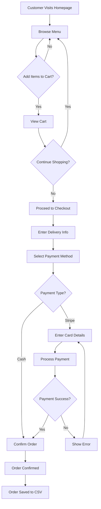
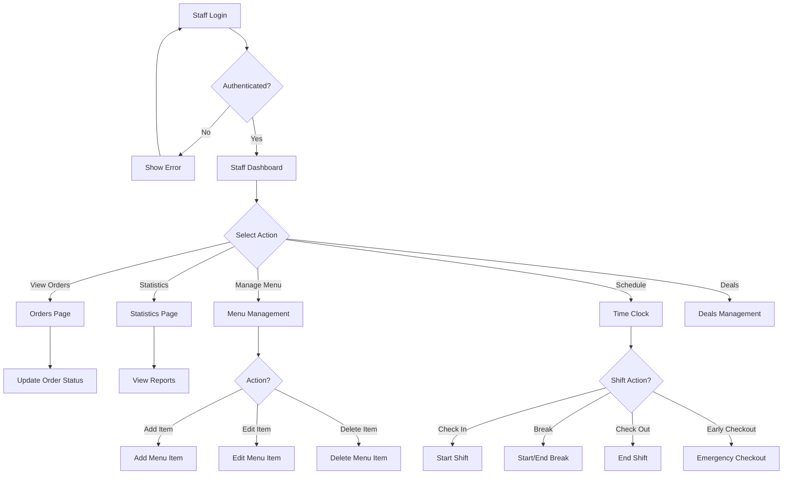
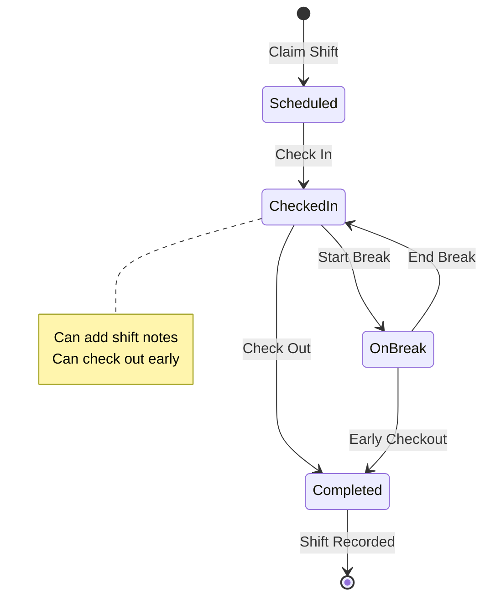
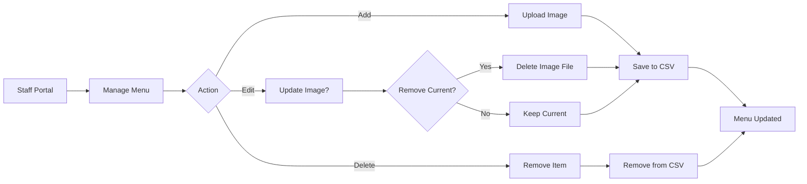

# Item7 Food Truck - Complete Documentation

## 📋 Table of Contents
1. [Project Overview](#project-overview)
2. [System Architecture](#system-architecture)
3. [User Flows](#user-flows)
4. [Features](#features)
5. [Database Schema](#database-schema)
6. [API Endpoints](#api-endpoints)
7. [Deployment Guide](#deployment-guide)

---

## 🎯 Project Overview

**Item7 Food Truck** is a comprehensive Flask-based web application for managing a food truck business. It combines a public customer-facing ordering system with an internal staff management portal.

### Key Technologies
- **Backend**: Flask (Python)
- **Storage**: CSV files (data persistence)
- **Frontend**: HTML, CSS, JavaScript, Jinja2 templates
- **Payment**: Stripe integration (demo mode)
- **Maps**: Leaflet.js for delivery addresses

### Project Structure
```
cs120-food-truck/
├── app.py                 # Main Flask application
├── foodtruck.py           # Business logic & CSV operations
├── requirements.txt       # Python dependencies
├── data/                  # CSV data storage
│   ├── users.csv
│   ├── menu.csv
│   ├── orders.csv
│   ├── deals.csv
│   └── shifts.csv
├── templates/             # Jinja2 HTML templates
│   ├── home.html
│   ├── menu.html
│   ├── checkout.html
│   ├── staff_*.html
│   └── ...
├── static/                # Static assets
│   ├── style.css
│   └── images/
└── README.md
```

---

## 🏗️ System Architecture

### High-Level Architecture

```
┌─────────────────────────────────────────────────────────────┐
│                    Flask Application (app.py)                │
│  ┌──────────────┐  ┌──────────────┐  ┌──────────────┐     │
│  │   Routes     │  │  Templates   │  │   Session    │     │
│  │  (Views)     │  │  (Jinja2)    │  │  Management  │     │
│  └──────────────┘  └──────────────┘  └──────────────┘     │
└─────────────────────────────────────────────────────────────┘
                          │
                          ▼
┌─────────────────────────────────────────────────────────────┐
│              FoodTruck Class (foodtruck.py)                 │
│  ┌──────────┐  ┌──────────┐  ┌──────────┐  ┌──────────┐  │
│  │   Menu   │  │  Orders  │  │  Staff   │  │ Shifts   │  │
│  │  Mgmt    │  │  Mgmt    │  │  Mgmt    │  │  Mgmt    │  │
│  └──────────┘  └──────────┘  └──────────┘  └──────────┘  │
└─────────────────────────────────────────────────────────────┘
                          │
                          ▼
┌─────────────────────────────────────────────────────────────┐
│                    CSV Data Storage                          │
│  ┌──────────┐  ┌──────────┐  ┌──────────┐  ┌──────────┐  │
│  │ menu.csv │  │orders.csv│  │users.csv │  │shifts.csv│  │
│  └──────────┘  └──────────┘  └──────────┘  └──────────┘  │
└─────────────────────────────────────────────────────────────┘
```

### Component Interaction Flow

```
User Request
    │
    ▼
Flask Route Handler
    │
    ▼
FoodTruck Class Method
    │
    ▼
CSV File Operation
    │
    ▼
Return Data
    │
    ▼
Render Template
    │
    ▼
Response to User
```

---

## 🔄 User Flows

### 1. Customer Ordering Flow



### 2. Staff Portal Flow



### 3. Time Clock System Flow



### 4. Menu Management Flow



---

## ✨ Features

### Customer Features
1. **Menu Browsing**
   - View menu by category (Combo, Main, Veg, Side, Drink)
   - Carousel navigation for menu items
   - Filter by category

2. **Shopping Cart**
   - Add/remove items
   - Update quantities
   - View total with tax and tip

3. **Checkout**
   - Delivery address with map integration
   - Auto-location detection
   - Payment options (Stripe or Cash on Delivery)
   - Tip calculation (10%, 15%, 20%, 25%, or custom)
   - Tax calculation (7.5% default)

4. **Order Tracking**
   - View order history
   - Order confirmation

### Staff Features
1. **Dashboard**
   - Overview statistics
   - Today's shifts
   - Upcoming schedules

2. **Order Management**
   - View all orders
   - Update order status (Pending → Preparation Done → Ready for Delivery)
   - Allergy alerts and warnings
   - Search and filter orders

3. **Menu Management**
   - Add new menu items
   - Edit existing items
   - Delete items
   - Upload/remove images
   - Manage categories and allergens

4. **Time Clock System**
   - Claim shifts
   - Check in/out
   - Break management
   - Early checkout option
   - Shift notes
   - Work history tracking

5. **Statistics**
   - Daily/monthly/yearly totals
   - Revenue tracking
   - Top customers
   - Order trends

6. **Deals Management** (Senior Managers)
   - Create promotions
   - Set discounts
   - Manage active deals

7. **Staff Management** (Admins)
   - View staff directory
   - Remove staff members
   - Senior manager verification

---

## 💾 Database Schema

### CSV File Structures

#### users.csv
```csv
Email,Password,First_Name,Last_Name,Mobile_Number,Address,DOB,Sex,Role,Verified
```

**Fields:**
- `Email`: Primary identifier
- `Password`: Hashed password (pbkdf2:sha256)
- `Role`: customer, staff, or admin
- `Verified`: YES/NO

#### menu.csv
```csv
Item_ID,Name,Description,Price,Category,Vegan,Image,Allergens
```

**Fields:**
- `Item_ID`: Unique identifier (MENU_001, MENU_002, etc.)
- `Category`: Combo, Main, Veg, Side, Drink
- `Vegan`: TRUE/FALSE
- `Allergens`: Comma-separated list

#### orders.csv
```csv
Order_ID,Customer_Name,Customer_Email,Item,Allergy_Info,Is_Safe,Timestamp,Status,Payment_ID,Tip_Amount,Tax_Amount
```

**Fields:**
- `Status`: Pending, Preparation Done, Ready for Delivery
- `Payment_ID`: Stripe payment ID or "cash_on_delivery"
- `Tip_Amount`: Tip in dollars
- `Tax_Amount`: Tax in dollars

#### shifts.csv
```csv
Shift_ID,Staff_Email,Date,Scheduled_Start,Scheduled_End,Check_In_Time,Check_Out_Time,Break_Start,Break_End,Total_Hours,Status,Notes,Early_Checkout
```

**Fields:**
- `Status`: scheduled, checked_in, on_break, completed
- `Early_Checkout`: YES/NO
- `Notes`: Shift notes text

#### deals.csv
```csv
Deal_ID,Title,Description,Discount,Created_By,Created_At,Expires_At,Is_Active
```

---

## 🔌 API Endpoints

### Public Endpoints

| Endpoint | Method | Description |
|----------|--------|-------------|
| `/` | GET | Homepage with featured menu items |
| `/menu` | GET | Full menu page |
| `/cart` | GET | Shopping cart |
| `/checkout` | GET/POST | Checkout page and order submission |
| `/api/menu` | GET | JSON menu items |
| `/api/menu/<category>` | GET | Menu items by category |
| `/api/cart` | GET | Current cart contents |

### Staff Endpoints (Require Authentication)

| Endpoint | Method | Description |
|----------|--------|-------------|
| `/staff/dashboard` | GET | Staff dashboard |
| `/staff/orders` | GET | Order management |
| `/staff/statistics` | GET | Statistics dashboard |
| `/staff/menu` | GET | Menu management |
| `/staff/menu/add` | POST | Add menu item |
| `/staff/menu/edit/<id>` | GET/POST | Edit menu item |
| `/staff/menu/delete/<id>` | POST | Delete menu item |
| `/staff/schedule` | GET | Time clock page |
| `/staff/shifts/claim` | POST | Claim a shift |
| `/staff/time-clock/checkin` | POST | Check in |
| `/staff/time-clock/checkout` | POST | Check out |
| `/staff/time-clock/break` | POST | Start break |
| `/staff/time-clock/break-end` | POST | End break |
| `/staff/time-clock/checkout-early` | POST | Early checkout |
| `/staff/shift/add-note` | POST | Add shift notes |
| `/staff/deals` | GET | Deals management |
| `/staff/deals/create` | POST | Create deal |

---

## 🚀 Deployment Guide

### Local Development

1. **Clone Repository**
   ```bash
   git clone https://github.com/t4thick/cs120-food-truck.git
   cd cs120-food-truck
   ```

2. **Install Dependencies**
   ```bash
   pip install -r requirements.txt
   ```

3. **Configure Environment**
   ```bash
   cp .env.example .env
   # Edit .env with your settings
   ```

4. **Run Application**
   ```bash
   python3 app.py
   # Or
   PORT=5001 python3 app.py
   ```

5. **Access Application**
   - Homepage: http://localhost:5001
   - Staff Portal: http://localhost:5001/staff/dashboard

### Production Deployment (Render.com)

1. **Connect Repository**
   - Link GitHub repository to Render
   - Render will auto-detect Flask app

2. **Environment Variables**
   ```
   SECRET_KEY=your-secret-key-here
   ADMIN_EMAILS=admin@example.com
   STAFF_REGISTRATION_CODE=1234
   SENIOR_MANAGER_CODE=1234
   TAX_RATE=0.075
   ```

3. **Build Settings**
   - Build Command: `pip install -r requirements.txt`
   - Start Command: `python3 app.py`

4. **Deploy**
   - Render will automatically deploy on push to main branch

---

## 🔐 Security Features

1. **Password Hashing**: pbkdf2:sha256 (compatible with Python 3.9+)
2. **Session Management**: Flask sessions with secret key
3. **Role-Based Access Control**: Customer, Staff, Admin roles
4. **CSV Input Sanitization**: Prevents CSV injection
5. **File Upload Validation**: Image file type checking
6. **Staff Registration Code**: Secret code required for staff signup

---

## 📊 Data Flow Diagrams

### Order Processing Flow

```
Customer → Add to Cart → Checkout → Payment Processing
    │                                          │
    │                                          ▼
    │                                    Stripe API
    │                                    (or Cash)
    │                                          │
    ▼                                          ▼
Session Storage                          Order Saved
    │                                    to orders.csv
    │                                          │
    └──────────────────────────────────────────┘
                                    │
                                    ▼
                            Staff Notification
                            (Order appears in
                            staff portal)
```

### Menu Item Lifecycle

```
Staff → Add Menu Item → Upload Image → Save to menu.csv
    │                                        │
    │                                        ▼
    │                                  Menu Updated
    │                                        │
    ▼                                        ▼
Edit Item ←─────────────────────────── Display on Menu
    │                                        │
    ▼                                        ▼
Update CSV                            Customer Views
    │                                        │
    └────────────────────────────────────────┘
                                    │
                                    ▼
                            Add to Cart
```

---

## 🧪 Testing Checklist

- [x] App initializes correctly
- [x] Menu loads from CSV
- [x] Routes are accessible
- [x] Templates render properly
- [x] Menu management functions work
- [x] Time clock system operational
- [x] Order processing works
- [x] Staff authentication works
- [x] Image uploads work
- [x] CSV operations work

---

## 📝 Notes

- **CSV Storage**: All data is stored in CSV files for simplicity
- **Image Storage**: Uploaded images stored in `static/images/menu/`
- **Default Images**: SVG placeholders used until images uploaded
- **Demo Mode**: Stripe runs in demo mode when API keys not configured
- **Auto-Migration**: Menu items auto-migrate from hardcoded to CSV on first run

---

## 🔗 Links

- **Repository**: https://github.com/t4thick/cs120-food-truck
- **Live Demo**: https://item7-food-truck.onrender.com (if deployed)

---

**Last Updated**: November 2024
**Version**: 2.0
**Maintainers**: CS120 Team

