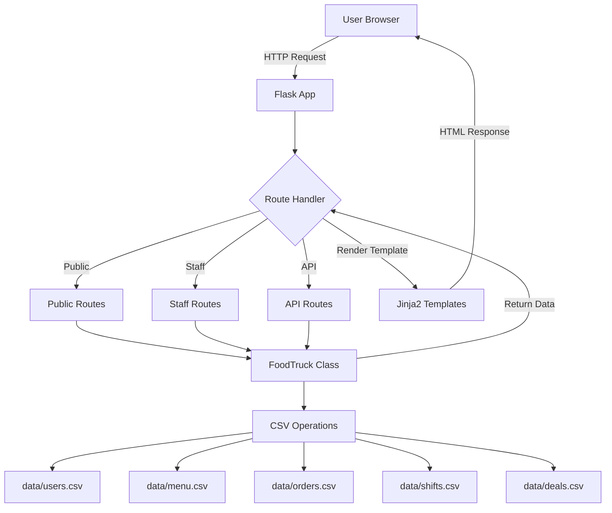
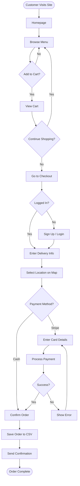
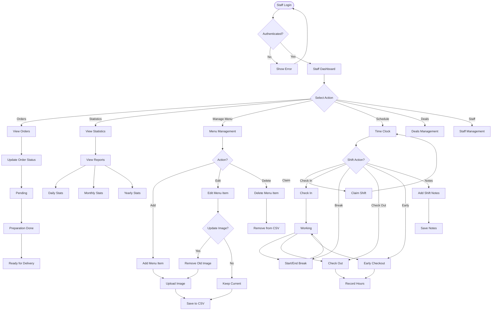
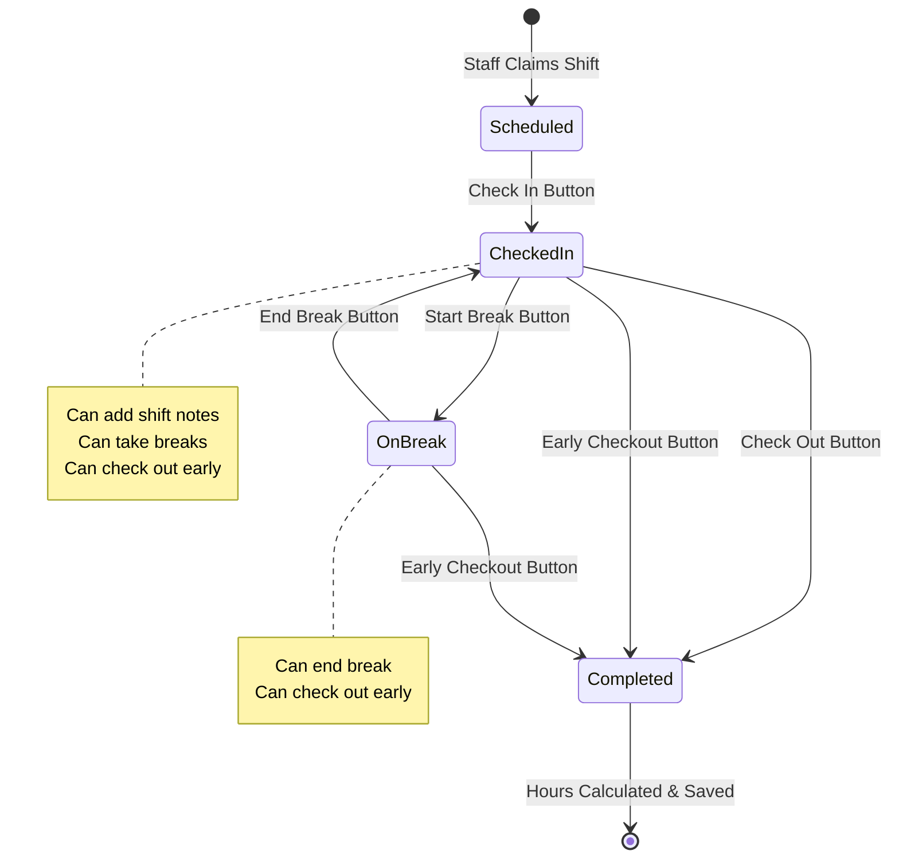
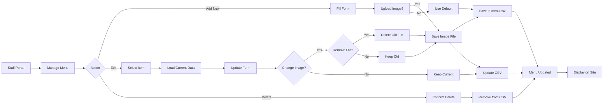
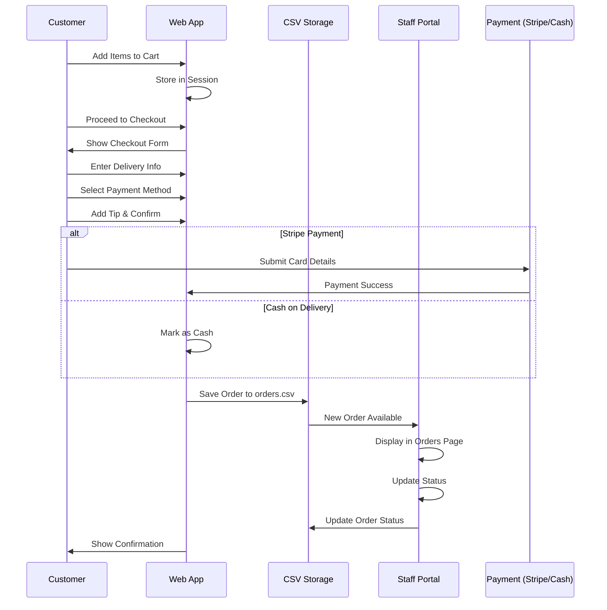
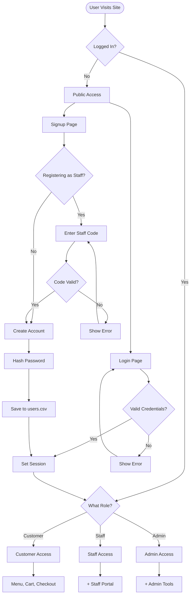
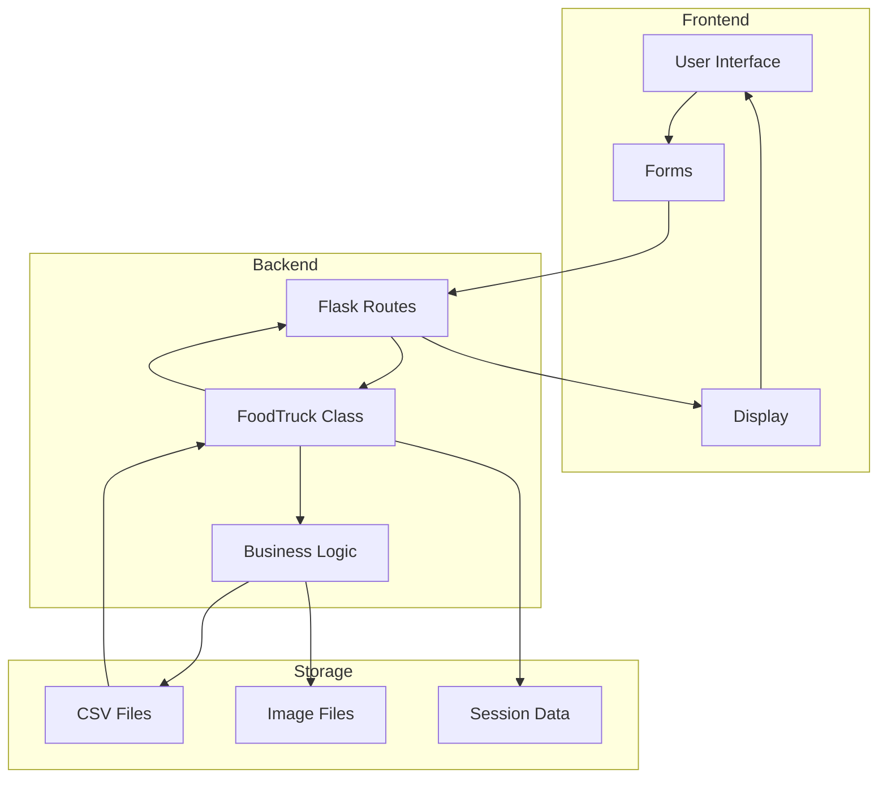
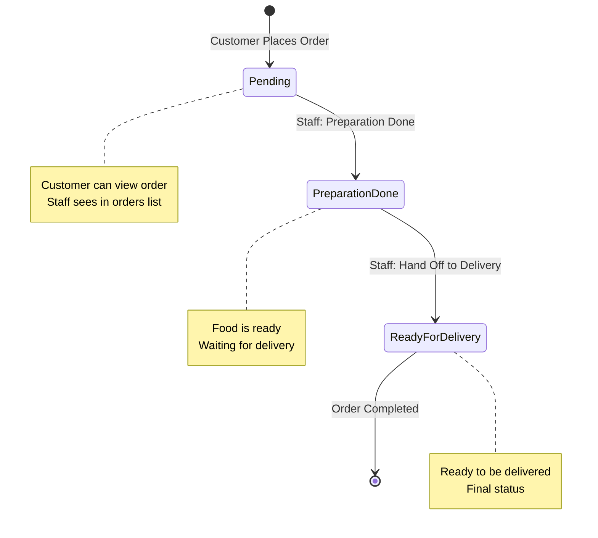
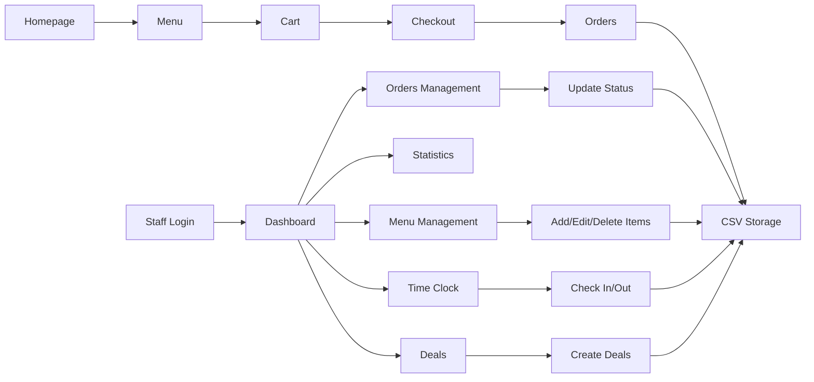

# Item7 Food Truck - System Flowcharts

This document contains visual flowcharts for understanding the system architecture and user flows.

## 📊 Table of Contents
1. [System Architecture Flow](#system-architecture-flow)
2. [Customer Ordering Flow](#customer-ordering-flow)
3. [Staff Portal Flow](#staff-portal-flow)
4. [Time Clock System Flow](#time-clock-system-flow)
5. [Menu Management Flow](#menu-management-flow)
6. [Order Processing Flow](#order-processing-flow)
7. [Authentication Flow](#authentication-flow)

---

## 🏗️ System Architecture Flow



---

## 🛒 Customer Ordering Flow



---

## 👨‍💼 Staff Portal Flow



---

## ⏰ Time Clock System Flow



### Time Clock State Transitions

```
┌──────────┐
│ Scheduled│ ← Staff claims a shift
└────┬─────┘
     │ Check In
     ▼
┌──────────┐
│Checked In│ ← Working on shift
└────┬─────┘
     │ Start Break
     ▼
┌──────────┐
│ On Break │ ← Taking a break
└────┬─────┘
     │ End Break
     ▼
┌──────────┐
│Checked In│ ← Back to work
└────┬─────┘
     │ Check Out
     ▼
┌──────────┐
│Completed │ ← Shift finished
└──────────┘
```

---

## 🍽️ Menu Management Flow



---

## 📦 Order Processing Flow



---

## 🔐 Authentication Flow



---

## 🔄 Data Flow Diagram



---

## 📊 Order Status Lifecycle



---

## 🎯 Feature Interaction Map



---

## 📝 Notes

- All flowcharts use **Mermaid** syntax, which is supported by GitHub
- These diagrams can be viewed directly on GitHub or using Mermaid-compatible viewers
- Flowcharts represent the current system implementation as of November 2024

---

**Last Updated**: November 2024
**Version**: 2.0

