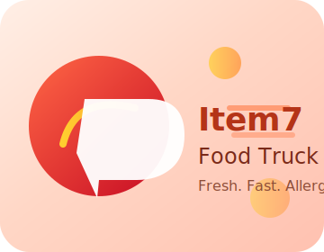

# Item7 Food Truck Management System

Flask-based web application for the CS120 "Item7 Food Truck". The site combines a public ordering experience with an internal, role-based management portal that lets staff manage profiles, shifts, and schedules directly from CSV-backed storage.



## 🌐 Live Demo

**Visit the live application:** [https://item7-food-truck.onrender.com](https://item7-food-truck.onrender.com)

---

## Features

- **Public ordering flow**: view menu, add to cart, checkout with allergy notes.
- **CSV persistence**: users, schedules, and orders remain simple files (`data/*.csv`), ideal for course environments.
- **Role-based authentication**:
  - Customers/guests get the public site only.
  - Staff accounts gain access to the staff dashboard, schedule, staff directory, and profile pages.
  - Admins (configured via `ADMIN_EMAILS`) can manage staff and schedules system-wide.
- **Staff portal (KFC-inspired UI)** with dedicated pages:
  - Dashboard (`/staff/dashboard`)
  - Staff Management (`/staff/management`)
  - Schedule (`/staff/schedule`)
  - Profile (`/staff/profile`)
- **REST endpoints**: e.g., `GET /api/appointments` returns booking data as JSON.
- **Auto-verification**: new users are automatically verified on registration.
- **Security improvements**: password hashing (Werkzeug), session checks, login throttling via flash messaging, CSV permission checks, and role enforcement.
- **Logging**: actions recorded to `ft_management.log`.

---

## Quick start

### Requirements

- Python 3.10+
- Pipenv/venv recommended

```bash
# Install deps
pip install -r requirements.txt

# Configure environment variables
# Option 1: Use .env file (recommended)
# Copy .env.example to .env and fill in your values:
cp .env.example .env
# Then edit .env with your SMTP credentials

# Option 2: Set environment variables manually (Windows PowerShell)
$env:SECRET_KEY="your-secret-key"
$env:ADMIN_EMAILS="boss@example.com"

# Run the Flask app
python app.py
# Open http://localhost:5000
```

### Deployment

When deploying to production (Heroku, Railway, Render, etc.):

1. Set environment variables in your hosting platform's dashboard
2. Required: `SECRET_KEY` (generate with: `python -c "import secrets; print(secrets.token_hex(32))"`)
3. Optional: `ADMIN_EMAILS` (comma-separated admin email addresses)
4. See `DEPLOYMENT.md` or `RENDER_SETUP.md` for detailed deployment instructions

---

## Directory overview

```
app.py                  # Flask routes and auth
foodtruck.py            # CSV helper class & business rules
static/style.css        # Shared UI styling + staff portal design
templates/              # Jinja templates
  staff_layout.html     # Base layout for staff pages
  staff_dashboard.html
  staff_management.html
  staff_schedule.html
  staff_profile.html
data/
  users.csv             # Email, Password, First_Name... , Role
  schedules.csv
  orders.csv
```

---

## Staff roles & access

`data/users.csv` now stores a `Role` column:

| Role      | Description                                             |
|-----------|---------------------------------------------------------|
| `staff`   | Can access `/staff/*` dashboards + public site          |
| `customer`| Public ordering only (no staff portal)                  |
| `admin`   | Same as staff plus admin tools (configured via env var) |

Signup form asks whether the user is staff or customer. Admins can still invite staff through the admin UI.

### Navigation behavior

- Logged-out users see `Home | Menu | Cart | Login | Sign up`.
- Logged-in customers see `Home | Menu | Cart | Dashboard | Logout`.
- Logged-in staff/admin additionally see `Staff Portal`.

---

## Staff portal pages

| Path                 | Description                                                |
|----------------------|------------------------------------------------------------|
| `/staff/dashboard`   | Hero banner, stats, today’s shifts, upcoming shifts        |
| `/staff/management`  | Staff directory preview (read from `users.csv`)            |
| `/staff/schedule`    | Weekly view + real-time open slot booking                  |
| `/staff/profile`     | Profile snapshot + link to `/update_profile`               |

Every page extends `staff_layout.html`, which provides the left navigation (Dashboard, Staff Management, Schedule, My Profile) and ensures consistent UI colors.

---

## CSV schemas

```
users.csv
Email,Password,First_Name,Last_Name,Mobile_Number,Address,DOB,Sex,Role

schedules.csv
Manager,Date,Time,staff_Email,staff_Name,work_Time

orders.csv
Order_ID,Customer_Name,Customer_Email,Item,Allergy_Info,Is_Safe,Timestamp
```

Files are created automatically (with headers) on first run.

---

## API endpoints

| Endpoint                        | Method | Description                                  |
|---------------------------------|--------|----------------------------------------------|
| `/api/appointments`            | GET    | Returns all schedules as JSON                |
| `/book_appointment`            | POST   | Validates and writes a booking to CSV        |
| `/get_available_slots/<staff>/<date>` | GET | Returns open time slots for staff/date       |

All routes share consistent error handling and JSON structures.

---

## Testing tips

1. Remove `data/*.csv` to start fresh; the app will re-create them.
2. Sign up twice: once as a customer, once as staff. Confirm that the customer cannot visit `/staff/dashboard`.
3. Set `ADMIN_EMAILS` and log in as that email to reveal admin nav links.

---

## License & Credits

MIT License. Built for CS120 coursework, inspired by the KFC Shift Manager experience. Contributions welcome via PR.

---
